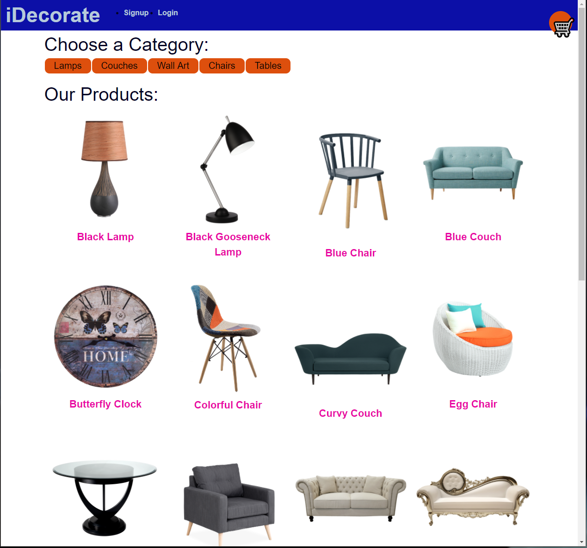
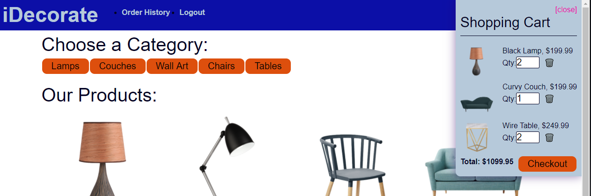
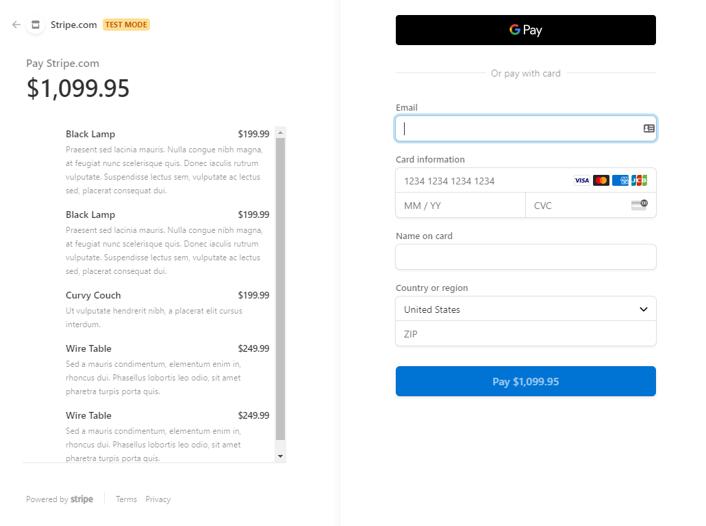

# iDecorate

          

 
 
 
 
 ## Table of Contents:  

[1. Description](#Description)  
[2. Technology Used](#Technology-Used)  
[3. Screen Shots](#Screen_Shots)  
[4. Installation](#Installation)  
[5. License Details](#License-Details)  
[6. Submission](#Submission)   
[7. Questions](#Questions)  

## Description:  
iDecorate is a application that can help you decorate your living space.  Simply login, select your area and add the items that you want to your cart.


## Technology Used  
- React for the front end.  
- GraphQL with a Node.js and Express.js server.  
- MongoDB and the Mongoose ODM for the database.  
- Queries and mutations for retrieving, adding, updating, and deleting data.  
- JWT authentication.  
- Meet the minimum requirements of a PWA:  
  - Uses a web manifest
  - Uses a service worker for offline functionality
  
## Screen Shots
  

  

  


## Installation


To run this app locally do the following:  
1. Download the source files from the github repository located here: [iDecorate github Repository](https://github.com/DVanEman/iDecorate)  

2. Run the following at the command line
```
    $ npm install
    $ npm run seed
```

3. Start the server
```
    $ npm start
```

## License Details  
This project is under no license.

## Submission  
[github repository](https://github.com/DVanEman/iDecorate)  
[Walkthrought Video](https://drive.google.com/file/d/1v5ggFzEszBSWP4DeNuvwDv1lqNUM6ILF/view)  
[iDecorate heroku depolyment (placeholder link)](htts://heroko.deployment.placeholder)

## Questions:  

### Andrew Van Eman  [github](https://github.com/DVanEman) - [email](d.vaneman25@gmail.com)

### DeMario Williams  [github](https://github.com/DWill1440) - [email](dwill2think@gmail.com)

### Jack Hoover  [github](https://github.com/jhoover1077) - [email](j.hoover1121@gmail.com)

### Ryanne Killian  [github](https://github.com/ryannekillian) - [email](ryanne.killian@gmail.com)

### Victor Cesar Lopez  [github](https://github.com/civ187) - [email](civ187@gmail.com)
